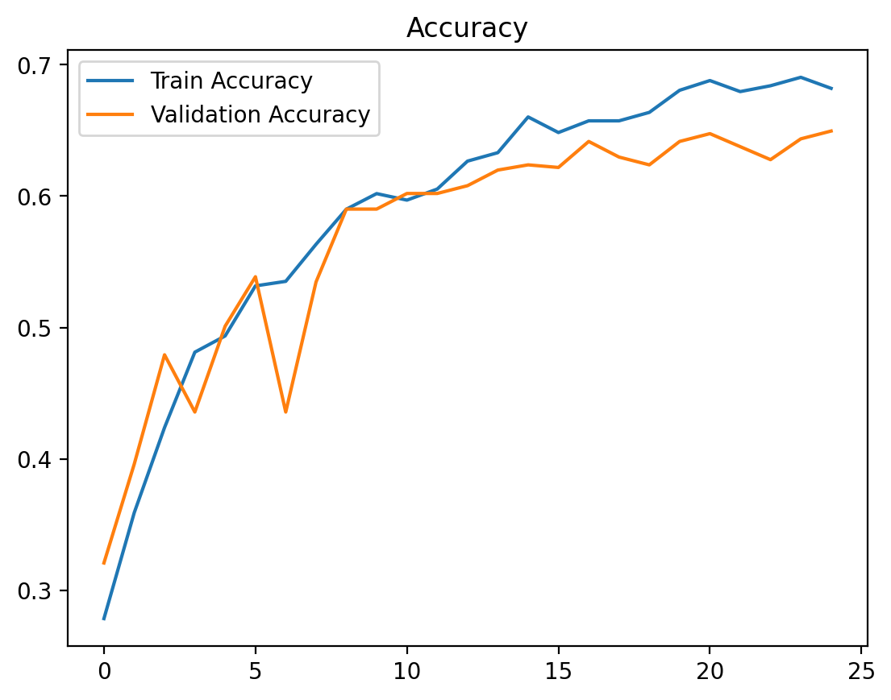
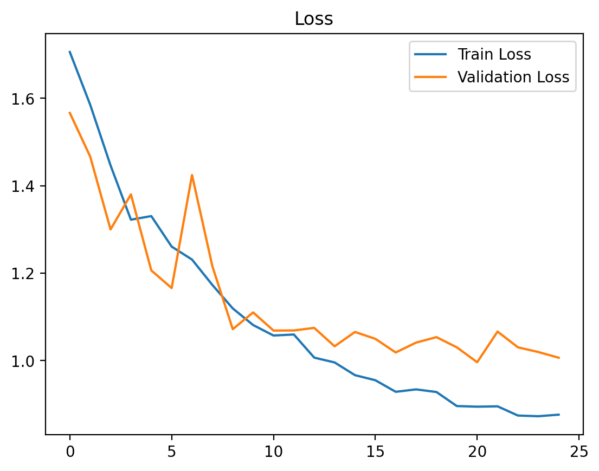
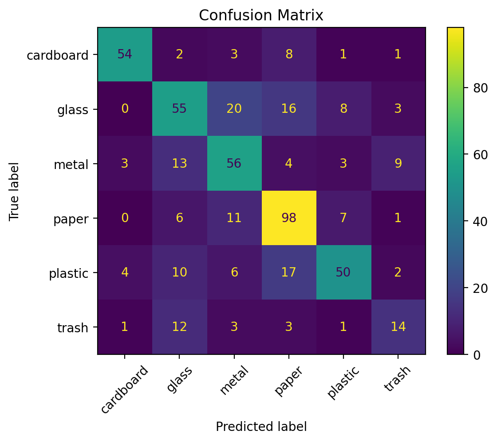
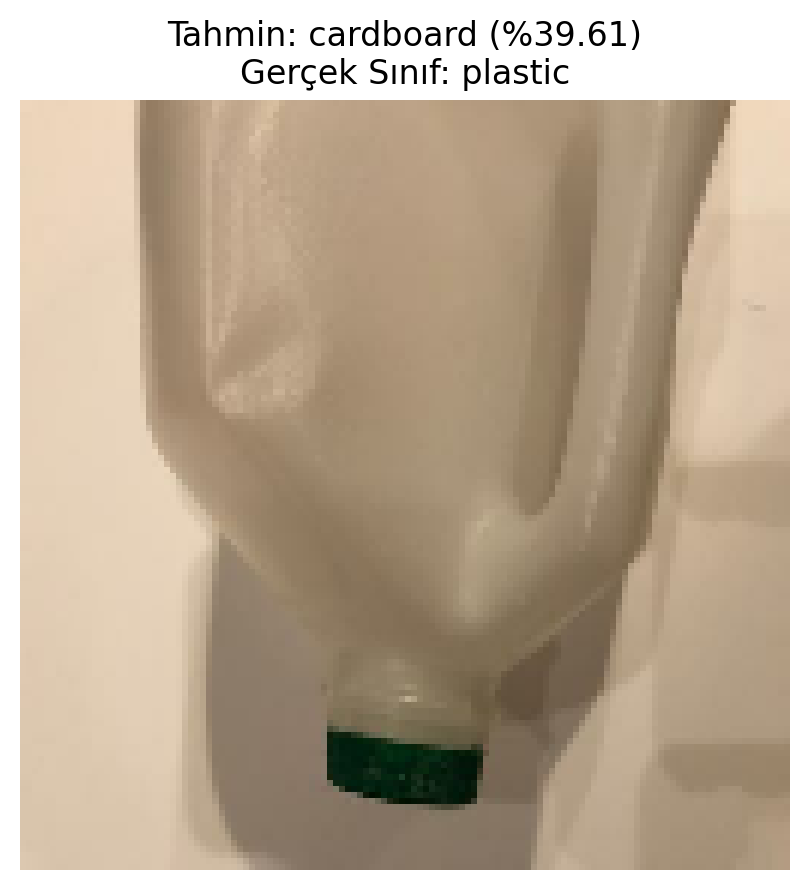

# 📦 Çöp Türü Sınıflandırma  
## CNN – Keras / TensorFlow

---

## 1️⃣ Veri Seti Açıklaması

Bu projede **Kaggle – Garbage Classification** veri seti kullanılmıştır.  
Amaç, çöp görüntülerini **6 farklı sınıfa** ayırabilen bir **Evrişimli Sinir Ağı (CNN)** modeli geliştirmektir.

### Sınıflar
- cardboard (karton)
- glass (cam)
- metal
- paper (kâğıt)
- plastic (plastik)
- trash (çöp)

### Veri Seti Özellikleri
- Toplam görüntü sayısı: **2527**
- Eğitim verisi: **2022 (%80)**
- Doğrulama verisi: **505 (%20)**
- Görüntü boyutu: **128×128 RGB**
- Veri bölme işlemi `validation_split=0.2` kullanılarak otomatik yapılmıştır.
- Dosya yolları **relative path** (`data/garbage`) ile ayarlanmıştır; bu sayede proje farklı bilgisayarlarda sorunsuz çalışır.

---

## 2️⃣ Model Mimarisi (CNN)

Model, **Keras (TensorFlow)** kullanılarak sıfırdan oluşturulmuş bir **Convolutional Neural Network (CNN)** mimarisidir. Hafif veri artırma uygulanmıştır.

### Mimari Yapı
- Rescaling (1/255)
- Conv2D (32 filtre) + MaxPooling
- Conv2D (64 filtre) + MaxPooling
- Conv2D (128 filtre) + MaxPooling
- Dropout (0.30)
- Flatten
- Dense (128, ReLU) + Dropout (0.4)
- Çıkış Katmanı: Dense (6, Softmax)

### Eğitim Ayarları
- Optimizer: **Adam (learning rate = 0.001)**
- Kayıp Fonksiyonu: **Sparse Categorical Crossentropy**
- Başarı Metrikleri: **Accuracy**
- Kullanılan Callback’ler:
  - EarlyStopping (val_loss izlenerek)
  - ReduceLROnPlateau

Bu callback’ler sayesinde model, **overfitting başlamadan önce** en iyi epoch’ta durdurulmuştur.

---

## 3️⃣ Eğitim Sonuçları ve Başarı Metrikleri

### En İyi Sonuçlar
- En iyi epoch (val_loss’a göre): **18**
- En iyi doğrulama kaybı (val_loss): **0.9491**
- En iyi doğrulama doğruluğu (val_accuracy): **%67.33**

---

### Accuracy Grafiği


**Yorum:**  
Eğitim doğruluğu epoch ilerledikçe düzenli olarak artarken, doğrulama doğruluğu veri setinin sınırlı olması ve bazı sınıfların görsel olarak birbirine benzemesi nedeniyle dalgalı bir yapı göstermektedir. EarlyStopping mekanizması sayesinde en iyi genelleme performansı **18. epoch** civarında elde edilmiştir.

---

### Loss Grafiği


**Yorum:**  
Doğrulama kaybı başlangıçta düşüş göstermiş, **18. epoch** civarında minimum değere ulaşmıştır. Bu noktadan sonra doğrulama kaybında artış gözlemlenmesi, **overfitting eğiliminin başladığını** göstermektedir. EarlyStopping ve ReduceLROnPlateau kullanılarak bu durum kontrol altına alınmıştır.

---

### Confusion Matrix


**Yorum:**
- **paper** ve **cardboard** sınıfları yüksek doğrulukla tahmin edilmiştir.
- **glass**, **metal** ve **plastic** sınıfları, görsel ve dokusal benzerlikler nedeniyle zaman zaman birbiriyle karıştırılmaktadır.
- **trash** sınıfı, az sayıda örnek ve belirsiz görsel özellikler nedeniyle model için en zor sınıf olmuştur.

Bu sonuçlar, veri setinin yapısı göz önüne alındığında **beklenen ve tutarlı** bir davranış sergilemektedir.

---

## 4️⃣ Classification Report (Özet)

- Genel doğruluk: **%67**
- Macro F1-score: **0.65**
- Weighted F1-score: **0.67**

Model, sınıflar arası dengesizlik ve yüksek görsel benzerliğe rağmen **dengeli precision–recall değerleri** elde etmiş ve temel bir CNN mimarisi için **akademik olarak kabul edilebilir** bir genelleme başarısı göstermiştir.

---


## 5️⃣ Projenin Çalıştırılması

1. Veri setini `data/garbage/` klasörüne yerleştirin (sınıf klasörleri içinde).
2. `garbage_cnn.ipynb` dosyasını açın.
3. Tüm hücreleri sırasıyla çalıştırın.


## 6️⃣ Genel Değerlendirme ve Sonuç

Bu çalışmada, çöp görüntülerini sınıflandırmak amacıyla Keras ve TensorFlow kullanılarak bir Evrişimli Sinir Ağı (CNN) modeli geliştirilmiştir. Model, sınıflar arası yüksek görsel benzerlik ve sınırlı veri miktarına rağmen istikrarlı bir öğrenme süreci göstermiştir.

Elde edilen sonuçlar incelendiğinde, modelin özellikle **paper** ve **cardboard** gibi görsel olarak ayırt edilebilir sınıflarda yüksek doğruluk sağladığı, **glass**, **metal** ve **plastic** gibi sınıflarda ise görsel benzerlik nedeniyle karışıklıklar yaşadığı gözlemlenmiştir. **trash** sınıfı, veri sayısının azlığı ve belirsiz görsel özellikleri nedeniyle en zor sınıf olmuştur.

EarlyStopping ve ReduceLROnPlateau callback’leri sayesinde overfitting kontrol altına alınmış ve model, doğrulama kaybının en düşük olduğu **18. epoch**’ta en iyi performansına ulaşmıştır. Yaklaşık **%67 doğrulama doğruluğu** ve dengeli precision–recall değerleri, temel bir CNN modeli için **akademik olarak kabul edilebilir ve tutarlı** bir performans sunmaktadır.

Bu proje, daha derin mimariler, veri artırma (data augmentation) teknikleri veya daha büyük veri setleri kullanılarak ileride geliştirilebilir.

### Gerekli Kütüphaneler
```bash
pip install -r requirements.txt

```
### Örnek Tahmin (Rastgele Görüntü)
Modelin gerçek kullanım senaryosunu göstermek amacıyla, doğrulama veri setinden rastgele seçilen bir görüntü üzerinde sınıf tahmini ve olasılık değeri (confidence) hesaplanmıştır.


